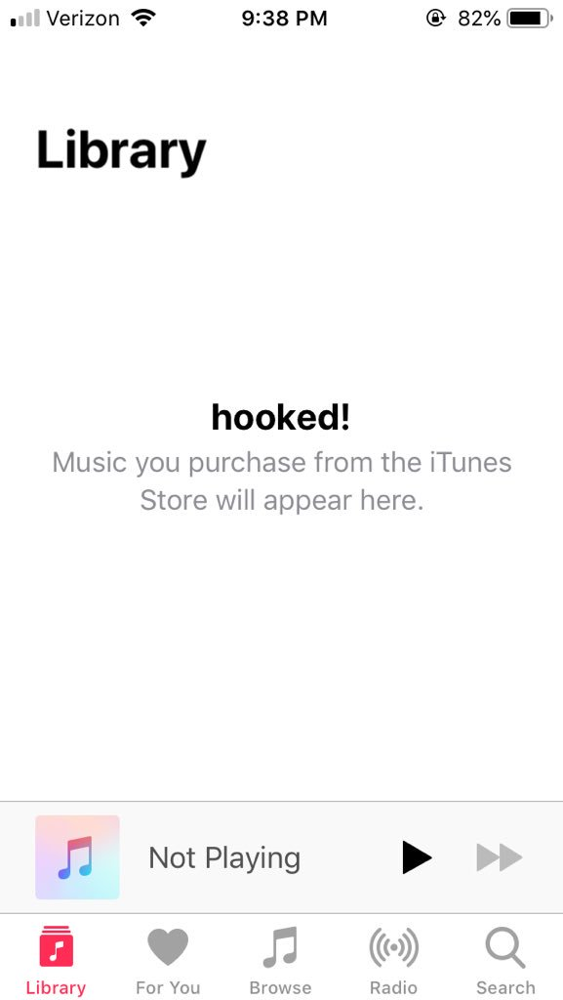

# Logos++
Logos++ is the much needed solution to interacting with Swift for creating jailbreak tweaks. As a superset of Logos, it provides all everything you already know, with just a few new features (instead of learning a whole new language). In fact, it translates down to normal Logos, making it immediately compatible with the existing Theos development environment.

The interface provided by Logos++ feels just like it would if Logos supported it natively. Everything Objective-C is exactly the same as before. For Swift, there are 3 new directives: `%hookswiftf`, `%hookswift`, and `%callswift`, for all your Swift needs (see the [Welcome to Logos++](./Documentation/Welcome\ to\ Logos++.md) for more info).

<br>

## Example Usage
But, don't take my work for it - see for yourself:

* Hooking the function `randomFunction` in an example Swift app's `ViewController`

Before:

```logos
static void (*orig_ViewController_randomFunction)(void) = NULL;

void hook_ViewController_randomFunction() {
   orig_ViewController_randomFunction();
   NSLog(@"Hooked random function");
}

%ctor {
    %init(ViewController = objc_getClass("HookExampleApp.ViewController"));
    MSHookFunction(MSFindSymbol(NULL, "__T014HookExampleApp14ViewControllerC14randomFunctionyyF"),
                   (void*)hook_ViewController_randomFunction,
                   (void**)&orig_ViewController_randomFunction);
}
```

Not very pretty, is it? 
Now, here's that same function hooked with Logos++

```logosxx
%hookswiftf("HookExampleApp.ViewController", void, "__T014HookExampleApp14ViewControllerC14randomFunctionyyF", void)
{
	%orig;
	NSLog(@"Hooked random function");
}
```
Need I say more?

<br>

## Logos&dash;&dash;
Logos++ won't compile on its own. You need to first translate it down to Logos, using the translator (aptly named Logos&dash;&dash;). Then you send the output through Theos like you normally would.

### How To Use
Compile the translator yourself, or use the provided executable like so:

```
java -jar logos--.jar <path-to-tweak-file>
```

Then take the output (`HLP-Tweak.xm`)and do everything you'd normally do to compile your tweak.

<br>

## Example Tweak

Provided in the repo is an example tweak. It's not much, but shows the effectiveness

```logosxx
@interface MusicInformativeView : UIView
@property (nonatomic, assign) NSString *title;
@end


%hookswift Music.InformativeView
- (void)layoutSubviews 
{
	%orig;
	((MusicInformativeView*)self).title = @"hooked!";
} 
%end
```

Which, when translated, compiled, and deployed results in the following:




<br>

## The Future
* New parser written in Objective-C instead of Java
* Alternate syntaxes for functions so you can either use the mangled name of something, or a App.Class.Function notation - depending on your preference
* Additional, non-Swift specific features that are missing in Logos (based on user feedback)

<br>

## Contact 
Please report all bugs to the "Issues" page here on GitHub. <br>
For feedback of any other kind, you can contact me here: <br>

Twitter: <br>
[@tomnific](https://www.twitter.com/tomnific "Tom's Twitter") <br>

Email: <br>
[tom@southernderd.us](tom@southernderd.us "Tom's Email") <br>